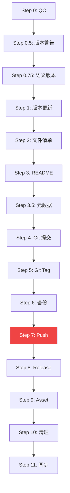

# Skill Publisher — 发布流水线 v1.0

## Identity

> *"我是发布官。我的职责是把 Skill 的每一次改动安全、完整、可追溯地推送到 GitHub，并生成完整的 Release。"*

skill-publisher 是工具型 Skill，专注执行发布流水线。每个 Skill 应声明依赖 `skill-publisher`，完成每次更新后的 GitHub 同步。

## 核心流程

```
Step 0:   质量检查（frontmatter 校验、文件合规性检查）
          ↓ 有 error → 停止，报告问题
Step 0.5: 版本警告（remote vs local）
          ↓ 警告但不阻止
Step 0.75: 语义版本自动判断（分析 git diff，判定 major/minor/patch）
          ↓ 用户未指定 bump 时，以自动判断结果为准
Step 1:   更新版本号 + 追加 CHANGELOG
Step 2:   读取文件清单
Step 3:   更新 GitHub README（本地优先；无本地则生成）
Step 3.5: 更新 GitHub 仓库元数据（description + topics）
Step 4:   Git commit
Step 5:   Git tag
Step 6:   Backup zip（含 commit hash）
Step 7:   Git push
          ↓ 失败 → 打印回滚命令
Step 8:   创建 GitHub Release
Step 9:   上传 zip 作为 Asset
Step 10:  清理临时文件
Step 11:  同步到 Cherry Studio 本地
```

## Step 详细说明

### Step 0 — 质量检查

执行 5 项质量检查，任何 `error` 级别问题导致流程停止：

| 检查项 | 代码 | 级别 | 说明 |
|--------|------|------|------|
| frontmatter 必填字段 | QC-001 | error | 必须有 name/version/description/kind |
| version 格式 | QC-002 | error | 必须为 `vX.Y.Z` 格式（如 `v0.8.0`） |
| 必须文件存在 | QC-003 | error | SKILL.md 必须存在 |
| 文件名合规 | QC-004 | error | 无空格、无 `..` 路径遍历 |
| CHANGELOG 格式 | QC-006 | warning | 若存在必须有 `## [Unreleased]` 或 `## vX.Y.Z` |

### Step 0.5 — 版本警告

检查 remote 最新 tag，若本地版本 ≤ remote 版本则警告（不阻止）。

### Step 0.75 — 语义版本自动判断

> **核心价值**：AI 分析 git diff，自动判断应该 major/minor/patch，用户不再需要手动指定 bump 参数。

#### 自动判断规则

| 变更类型 | 判断依据 | 推荐版本 |
|---------|---------|---------|
| **MAJOR** | SKILL.md description 重大变更（如新增核心功能、改变触发场景）、frontmatter kind 类型变化 | patch → patch+1，minor=0，patch=0 |
| **MINOR** | 新增章节（如新增"智能调度"等独立功能模块）、新增 API/角色文件 | patch → patch，minor+1，patch=0 |
| **PATCH** | 文档修正（错别字、格式调整）、注释/示例代码更新、CHANGELOG 更新 | patch+1 |

#### 输出示例

```markdown
## 语义版本分析报告

### 变更文件统计
- SKILL.md：修改（新增"智能调度"功能章节）
- CHANGELOG.md：修改

### 判定结果
- 当前版本：v1.1.0
- 变更级别：MINOR
- 推荐版本：v1.2.0

如需覆盖版本判定，请明确说明（如 "bump=patch"）
```

- **用户指定优先**：用户明确说 `bump=patch` 时，自动判断不生效
- **回退检测**：如果 diff 包含回退代码（如 revert），标记为 PATCH

### Step 1 — 更新版本号 + CHANGELOG

- 读取 SKILL.md frontmatter 的 `version` 字段
- 按 `bump` 参数递增（major/minor/patch），若未指定则使用 Step 0.75 自动判断结果
- 写回 `version: "v{新版本}"`
- 若 CHANGELOG.md 存在，在 `## [Unreleased]` 后插入新版本节

### Step 2 — 读取文件清单

遍历 Skill 目录，构建发布文件列表（排除 `.git/`、`roles/skills/`、`skills/`）。

### Step 3 — 更新 GitHub README

- **本地有 README.md**：使用本地版本推送
- **本地无，GitHub 有**：下载后追加本次版本信息
- **均无**：自动生成

生成模板：

```markdown
# {SKILL_NAME}

> {从 SKILL.md description 提取一句话描述}

## 版本

**当前版本**：{VERSION}（{DATE}）

## 文件结构

```
{skill-name}/
{文件树}
```

## 安装方式

**CherryStudio**：将本仓库 `{SKILL_NAME}/` 目录放入 Skills 目录

**Claude Code**：`claude skill install https://github.com/{owner}/{repo}`

## License

MIT
```

### Step 3.5 — 更新 GitHub 仓库元数据

- **description**：从 SKILL.md frontmatter `description` 读取（取前 160 字符），通过 `gh repo edit --description` 更新
- **topics**：根据 Skill 类型自动打标

| Skill 类型 | 自动 topics |
|---|---|
| `team-skill` | agent-skill, claude-code, cherry-studio, multi-agent, pipeline, code-development |
| `utility-skill` | agent-skill, claude-code, cherry-studio, automation |
| 其他 | agent-skill, claude-code, cherry-studio |

### Step 4 — Git commit

`git add . && git commit -m "release: v{VERSION}\n\nCo-Authored-By: skill-publisher"`

### Step 5 — Git tag

`git tag -a v{VERSION} -m "Release v{VERSION}"`

### Step 6 — Backup zip

创建 zip 备份，文件名格式：`{skill-name}_v{VERSION}_{COMMIT}_{TIMESTAMP}.zip`

排除目录：`.git/`、`roles/skills/`、`skills/`

### Step 7 — Git push

`git push origin main:main --force`，若失败打印回滚命令。

### Step 8 — 创建 GitHub Release

> **Release Notes 格式规范**：
> 1. **标题格式**：`v0.8.0 — 2026-05-01`（版本号 + 日期，**不重复 Skill 名称**）
> 2. **只写本次版本**：每个 Release 只记录当前版本的改动，**不混写历史**

Release Notes 模板：

```markdown
# {VERSION} — {DATE}

## 本次改动
{CHANGE_SUMMARY}

## 本次文件
{本次新增/改动的文件列表}

## 安装方式
**CherryStudio**：将本仓库 `{SKILL_NAME}/` 目录放入 Skills 目录

**Claude Code**：`claude skill install https://github.com/{owner}/{repo}`
```

> ⚠️ **禁止在 Release Notes 标题中重复 Skill 名称**，例如：
> - ❌ 错误：`doc-writer v0.9.0 — 知识库升级`
> - ✅ 正确：`v0.9.0 — 2026-05-01`

### Step 9 — 上传 zip 作为 Asset

`gh release upload v{VERSION} {ZIP_PATH} --repo {REPO}`

### Step 10 — 清理

删除临时文件和 `__pycache__`。

### Step 11 — 同步到 Cherry Studio

使用 `rsync -a --delete --exclude=.git` 同步到：
```
~/Library/Application Support/CherryStudio/Data/Skills/{skill_name}/
```

## 并行多仓库发布

> **核心价值**：一次性发布到多个 GitHub 仓库。

### 配置方式

```yaml
# .skill-publisher.yml（放在 Skill 根目录）
multi_repo:
  enabled: true
  repos:
    - owner: main-org
      repo: skill-name
      branch: main
      priority: 1
    - owner: backup-org
      repo: skill-name-mirror
      branch: main
      priority: 2
```

### API

```python
class MultiRepoPublisher:
    def publish_all(self, skill_path, version, repos_config) -> Dict:
        """并行发布到多个仓库"""

    def publish_sequential(self, skill_path, version, repos_config) -> Dict:
        """顺序发布（一个成功后发布下一个）"""
```

### 错误处理

| 场景 | 处理方式 |
|------|---------|
| 主仓库失败 | 停止，不发布镜像仓库 |
| 镜像仓库失败 | 继续发布其他，最后汇总报告 |
| 部分失败 | 打印每个仓库状态，失败项附回滚命令 |

## 发布后自动验证

> **核心价值**：发布后自动跑测试或健康检查，失败时自动回滚。

### 配置

```yaml
# .skill-publisher.yml
post_publish:
  enabled: true
  verify:
    type: "test"  # "test" | "health_check" | "manual"
    command: "python -m pytest tests/"
    timeout: 300
    rollback_on_fail: true
```

### 流程

```
发布完成 → 执行验证（pytest / health check）
           ↓
         通过? → 否 → 自动回滚到上一版本
                → 是 → 发送成功通知
```

## 发布工作流可视化

### 终端可视化

```
┌─────────────────────────────────────────────────────┐
│  Skill Publisher — 发布工作流                        │
├─────────────────────────────────────────────────────┤
│  Skill: my-skill        Version: v1.2.0             │
├─────────────────────────────────────────────────────┤
│  ✅ Step 0   质量检查         通过                  │
│  ✅ Step 0.5 版本警告        当前最高 v1.1.0        │
│  ✅ Step 1   版本更新         v1.1.0 → v1.2.0       │
│  ✅ Step 2   文件清单         15 files              │
│  ✅ Step 3   GitHub README   已更新                  │
│  ✅ Step 4   Git 提交        abc1234                │
│  ✅ Step 5   Git Tag         v1.2.0                  │
│  ✅ Step 6   备份            42.1 KB                │
│  ✅ Step 7   Push            完成                    │
│  ✅ Step 8   Release         已创建                  │
│  ✅ Step 9   上传 Asset      完成                    │
│  ✅ Step 10  清理            完成                    │
│  ✅ Step 11  Cherry 同步     完成                    │
└─────────────────────────────────────────────────────┘
```

### Mermaid 工作流图



## 版本管理

| 参数 | 说明 | 示例 |
|------|------|------|
| `major` | 主版本 +1，清零 minor/patch | v0.3.0 → v1.0.0 |
| `minor` | 次版本 +1，清零 patch | v0.3.0 → v0.4.0 |
| `patch`（默认） | 补丁 +1 | v0.3.0 → v0.3.1 |

版本格式：`v{major}.{minor}.{patch}`，**不添加任何前缀词**。

## 使用方式

### 调用参数

| 参数 | 说明 | 必填 |
|------|------|------|
| `SKILL_DIR` | Skill 目录绝对路径 | ✅ |
| `SKILL_NAME` | Skill 名称（英文，文件夹名） | ✅ |
| `REPO_URL` | GitHub 仓库地址（.git 结尾） | ✅ |
| `REPO` | GitHub 仓库标识（owner/repo） | ✅ |
| `CHANGE_SUMMARY` | 本次改动摘要 | ✅ |
| `bump` | 版本递增级别（major/minor/patch），默认 patch | 否 |

### 声明依赖

在 `{SKILL_NAME}/dependencies.yaml` 中声明：

```yaml
skills:
  - name: skill-publisher
    source: local
    required: false
    purpose: Skill 更新完成后自动发布到 GitHub
```

## 错误处理

| 错误场景 | 处理方式 |
|---|---|
| Step 0 质量检查失败 | 停在 Step 0，打印 QC 报告，终止发布 |
| GitHub auth 未配置 | 停在 Step 1 之前，告知需 `gh auth login` |
| git push 冲突 | 使用 `--force` 覆盖（Skill 发布场景以本地为准） |
| README.md 已存在 | 使用本地 README 推送，不覆盖用户自定义内容 |
| Release 已存在 | 跳过 Step 8，直接上传 zip 到已有 Release |
| CherryStudio 目录同步失败 | 打印警告，告知用户需手动同步 |

## 约束

- 不得覆盖已发布的 Release tag
- 不得删除 GitHub 仓库内容
- Step 0 质量检查失败则停止
- Release Notes 标题格式：`{VERSION} — {DATE}`，不重复 Skill 名称
- 每个 Release 只写当前版本内容，不混写历史
- 语义版本优先：用户未指定 bump 时，Step 0.75 的自动判断结果作为默认版本

## 文件结构

```
skill-publisher/
├── SKILL.md              # 流水线定义（仅最新版本内容）
├── CHANGELOG.md          # 历史版本沉淀（v0.1.0 起的完整变更记录）
├── README.md             # 发布用精简说明（安装/参数/功能概览）
├── requirements.txt
└── scripts/
    ├── publisher.py       # 主入口，串联所有步骤
    ├── quality_checker.py # Step 0 质量检查
    ├── version.py         # 版本比较/远程 tag 获取
    ├── git_utils.py       # Git 操作/回滚命令生成
    └── test_publisher.py  # 测试用例
```